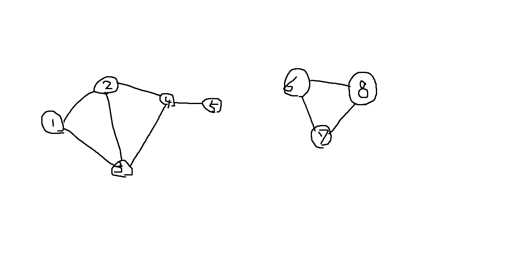

# 非連結グラフのDFS

Created: May 02, 2020 12:24 PM
Property: ape iria
Property 2: No
Tags: graph



↑のようなグラフを非連結グラフという。

訪問フラグのクリアは最初だけ行う。

```c
#include <stdio.h>

#define N 8 //点の数

int a[N+1][N+1]={{0,0,0,0,0,0,0,0,0},
                 {0,0,1,1,0,0,0,0,0},
                 {0,1,0,1,1,0,0,0,0},
                 {0,1,1,0,0,1,0,0,0},
                 {0,0,1,0,0,1,0,0,0},
                 {0,0,0,1,1,0,0,0,0},
                 {0,0,0,0,0,0,0,1,1},
                 {0,0,0,0,0,0,1,0,1},
                 {0,0,0,0,0,0,1,1,0}};
int v[N+1];

void visit(int);

void main(){
    int i,count=1;
    for (i = 1; i <=N ; ++i)
        v[i]=0;
    for (i = 1; i <=N ; ++i) {
        if (v[i] != 1) {
            printf("%d :", count++); //連結成分のカウント
            visit(i);
            printf("\n");
        }
    }
}
void visit(int i){
    int j;
    printf("%d ",i);
    v[i]=1;
    for (j = 1; j <=N ; ++j) {
        if(a[i][j]==1 && v[j]==0)
            visit(j);
    }
}
```

実行結果

```c
1 :1 2 3 5 4
2 :6 7 8
```