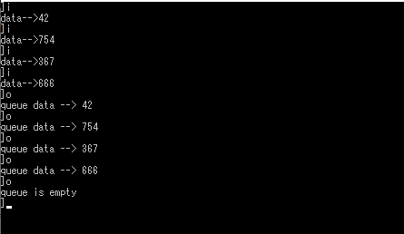

# 待ち行列(queue)

Created: Apr 18, 2020 9:04 PM
Property: ape iria
Property 2: No
Tags: Data structure

待ち行列の先頭を指す変数をhead。**末尾の次の要素を指す変数**をtailとします。（ここ注意です）

何故かというと待ち行列に何も要素が入ってない状態をhead==tailとしているためです。

待ち行列に要素を入れるごとに変数tailが1増えます。また、要素を取り出すごとに変数headが1増えます。

これで待ち行列は表現できるのですが、問題があります。それはheadもtailも単調に増加してしまうので、無限大の配列が必要だということです。

そこで、配列をリング状にして、最後の要素の次に最初の要素がつながっていると考えます。

このようにすれば、有限の大きさの配列によって待ち行列を表現することができます。

配列をリング状に扱うには、headとtailを1増加するときに%演算子を利用して剰余をとります。

    #include <stdio.h>
    
    #define MaxSize 100
    int queue[MaxSize];
    int head = 0, tail = 0;
    int queuein(int);
    int queueout(int*);
    
    void main() {
        int c, n;
    
        while (printf("]"), (c = getchar()) != EOF) {
            rewind(stdin);
            if (c == 'i' || c == 'I') {
                printf("data-->"); scanf("%d", &n);
                rewind(stdin);
                if (queuein(n) == -1) {
                    printf("queue is fulled\n");
                }
            }
            if (c == 'o' || c == 'O') {
                if (queueout(&n) == -1)
                    printf("queue is empty\n");
                else
                    printf("queue data --> %d\n", n);
            }
        }
    }
    int queuein(int n) {
        if ((tail + 1) % MaxSize != head) {
            queue[tail] = n;
            tail++;
            tail = tail % MaxSize;
            return 0;
        }
        else
            return -1;
    }
    int queueout(int* n) {
        if (tail != head) { //tail==headの時は空
            *n = queue[head];
            head++;
            head = head % MaxSize;
            return 0;
        }
        else
            return -1;
    }

実行結果

