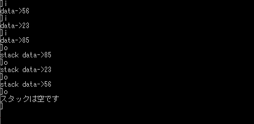

# スタック

Created: Apr 18, 2020 6:30 PM
Property: ape iria
Property 2: No
Tags: Data structure

スタックは一般に一次元配列を用いて実現できる。

データがスタックにpushされるたびにspの値は+1され、popされるたびに-1される。

スタックポインタspの初期値は最初0に設定しておき、データをpushするときは現spが示す位置にデータを積んでから、spを+1し、データをpopするときはspの値を-1してからそれが示す位置のデータを取り出すものとする。

    #include <stdio.h>
    #define MaxSize 100 //スタックサイズ
    int stack[MaxSize]; //スタック
    int sp = 0; //スタックポインタ
    int push(int);
    int pop(int*);
    void main() {
    int c, n;
    while (printf("]"), (c = getchar()) != EOF) {
    	rewind(stdin);
    	if (c == 'i' || c == 'I') {
    		printf("data->");
    		scanf("%d", &n); rewind(stdin);
    	if (push(n) == -1) {
    		printf("スタックがいっぱいです\n");
    	}
    }
    	if (c == 'o' || c == 'O') {
    	if (pop(&n) == -1)
    		printf("スタックは空です\n");
    	else
    		printf("stack data->%d\n", n);
    		}
    	}
    }
    int push(int n) { //スタックにデータを積む関数
    	if (sp < MaxSize) {
    	stack[sp] = n;
    	sp++;
    	return 0;
    }
    	else
    	return -1; //スタックがいっぱいのとき
    }
    int pop(int* n) { //スタックからデータを取り出す関数
    if (sp > 0) {
    sp--;
    *n = stack[sp];
    return 0;
    	}
    	else
    return -1; //スタックが空のとき
    }

実行結果

