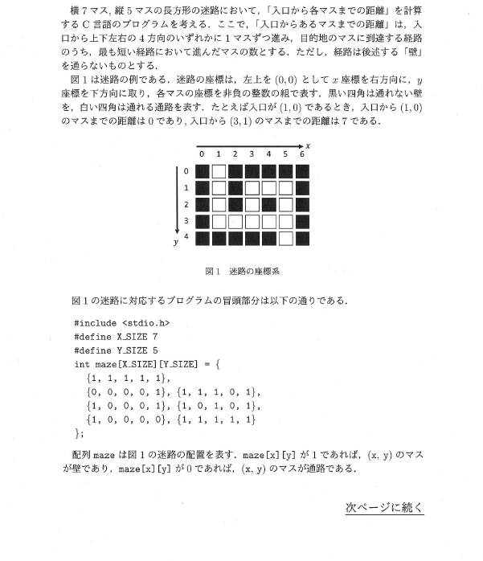
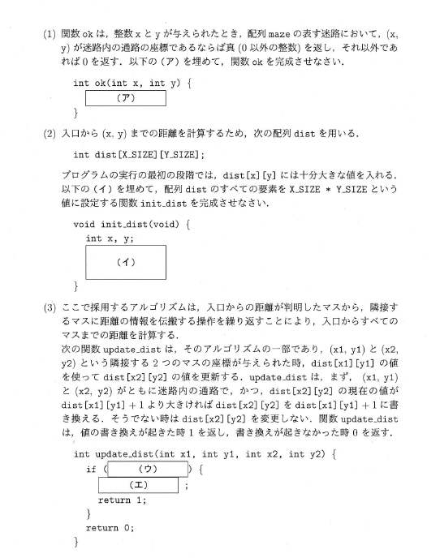
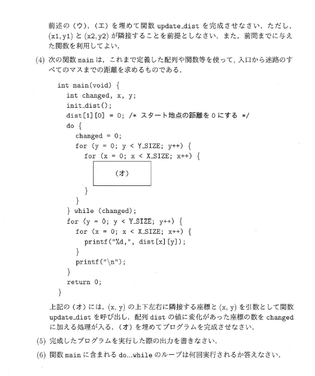
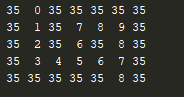

# 迷路

Created: Apr 17, 2020 2:06 PM
Property: ape iria
Property 2: No
Tags: 問題

    #include <stdio.h>
    #define X_SIZE 7
    #define Y_SIZE 5
    int dist[X_SIZE][Y_SIZE];
    int maze[X_SIZE][Y_SIZE]={{1,1,1,1,1},
                              {0,0,0,0,1},
                              {1,1,1,0,1},
                              {1,0,0,0,1},
                              {1,0,1,0,1},
                              {1,0,0,0,0},
                              {1,1,1,1,1}
    };
    int ok(int x,int y){
        if(maze[x][y]==0)
            return 1;
        else
            return 0;
    }
    int init_dist(void){
        int x,y;
        for (y = 0; y <Y_SIZE; ++y) {
            for (x = 0; x <X_SIZE ; ++x) {
                dist[x][y]=X_SIZE*Y_SIZE;
            }
        }
    }
    int update_dist(int x1,int y1,int x2,int y2){
        if(ok(x1,y1)&& ok(x2,y2)&& dist[x2][y2]>dist[x1][y1]+1){
            dist[x2][y2]=dist[x1][y1]+1;
            return 1;
        }
        return 0;
    }
    int main(){
        int changed, x,y;
        init_dist();
        dist[1][0]=0;
        do{
            changed=0;
            for (y = 0; y <Y_SIZE ; ++y) {
                for (x = 0; x <X_SIZE ; ++x) {
                    update_dist(x,y+1,x,y); if(update_dist(x,y,x,y+1))changed++;
                    update_dist(x-1,y,x,y); if(update_dist(x,y,x-1,y))changed++;
                    update_dist(x,y-1,x,y); if(update_dist(x,y,x,y-1))changed++;
                    update_dist(x+1,y,x,y); if(update_dist(x,y,x+1,y))changed++;
                }
            }
        }while(changed);
        for (y = 0; y <Y_SIZE ; ++y) {
            for (x = 0; x <X_SIZE ; ++x) {
                printf("%2d ",dist[x][y]); //見やすさのために%2dとしてます.
            }
            printf("\n");
        }
        return 0;
    }

実行結果

