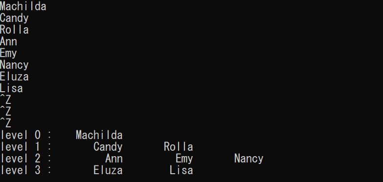

# 二分探索木のレベルごとのトラバーサル

Created: Apr 19, 2020 5:16 PM
Property: ape iria
Property 2: No
Tags: tree

レベルnの各ノードへのポインタが、最左端ノードから最右端ノードの順にスタックq[]に入っているものとすれば、このスタック情報をもとに、レベルnの各ノードを左から右に走査することができる。この走査の過程で各ノードの子を左の子、右の子の順に並べ、あれば、それへのポインタをスタックw[]に格納しておく。こうしてw[]に得られたデータが次のレベルの全ノードとなる。

したがって、レベルn+1の走査は、w[]→q[]にコピーし、上と同じことを繰り返せば良い。

    #include <stdio.h>
    #include <stdlib.h>
    #include <string.h>
    
    struct tnode {
        struct tnode* left; //左部分木へのポインタ
        char name[12]; //名前
        struct tnode* right; //右部分木へのポインタ
    };
    
    struct tnode* talloc(void);
    struct tnode* gentree(struct tnode*, char*);
    void treewalk(struct tnode*);
    
    void main() {
        char dat[12];
        struct tnode* root;
    
        root = NULL;
        while (scanf("%s", dat) != EOF) {
            root = gentree(root,dat); //返り値はポインタ
        }
        treewalk(root);
    }
    
    void treewalk(struct tnode* p) { //レベルごとの木のトラバーサル
        struct tnode* q[128],　//ポインタ・テーブル
                * w[128];     //作業用
        int i, child, n, level;
    
        child = 1; q[0] = p; level = 0; //初期値
        do {
            n = 0; //nが大きくなる→根が深くなってゆく.両ポインタがNULLの場合if文をすり抜けそのままwhile文脱出
            printf("level %d :", level);
            for (i = 0; i < child; i++) {
                printf("%12s", q[i]->name); //ノードの表示
    						//１つ下のレベルの子へのポインタをスタックに積む
                if (q[i]->left != NULL)
                    w[n++] = q[i]->left; //w[n]に値を入れたあとにインクリメント
                if (q[i]->right != NULL)
                    w[n++] = q[i]->right; //↑同様
            }
            printf("\n");
            child = n; //１つ下のレベルの子の数
            for (i = 0; i < child; i++)　
                q[i] = w[i];
            level++;　//根の深さ
        } while (child != 0);
    }
    struct tnode* gentree(struct tnode* p, char*w) { //木の作成の再帰手続き
        if (p == NULL) {
            p = talloc();
            strcpy(p->name, w);
            p->left = p->right = NULL;
        }
        else if (strcmp(w, p->name) < 0)
            p->left = gentree(p->left, w);
        else
            p->right = gentree(p->right, w);
        return p;
    }
    struct tnode* talloc() {
        return (struct tnode*)malloc(sizeof(struct tnode));
    }

実行結果

